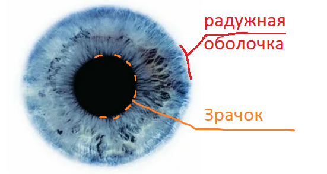

# Описание проекта: ИИ для идентификации пациента по радужной оболочке глаза

Этот проект представляет собой систему искусственного интеллекта (ИИ), разработанную для идентификации пациентов по изображению радужной оболочки глаза с использованием модели нейронной сети.

## Функциональность системы:

- **Идентификация пациента:** Система проводит анализ изображения радужной оболочки глаза пациента с использованием обученной модели нейронной сети для определения его уникальных характеристик.

- **Сравнение с базой данных:** Полученные характеристики сравниваются с данными, хранящимися в базе данных, для идентификации пациента.

- **Выдача результата:** Система выдает результат идентификации, определяя, совпадает ли радужная оболочка глаза с кем-то из зарегистрированных пациентов в базе данных.

## Преимущества системы:

- **Высокая точность идентификации:** Использование нейросетевой модели позволяет системе достичь высокой точности в идентификации пациентов по радужной оболочке глаза.

- **Безопасность данных:** Идентификация по радужной оболочке глаза обеспечивает высокий уровень безопасности, поскольку радужка уникальна для каждого человека, а данные хранятся в зашифрованном виде.

- **Быстрота и удобство:** Процесс идентификации происходит быстро и удобно для пациентов, не требуя от них никаких дополнительных усилий, кроме простого взгляда на камеру.

Этот проект открывает новые возможности в области биометрической идентификации, предоставляя надежный и удобный способ идентификации пациентов с использованием современных технологий искусственного интеллекта.
